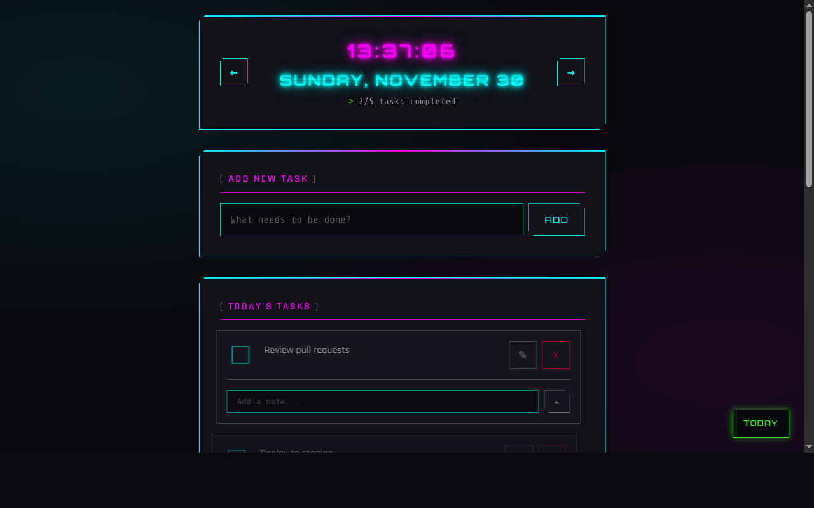

# Daily Todo List

Web-based daily task manager with cyberpunk aesthetic. Focus on one day at a time, carry over uncompleted tasks.



## Features

- Day-by-day task isolation (prevent overwhelm)
- Create, complete, edit, delete tasks
- Add timestamped notes to tasks
- Carry over uncompleted tasks to next day
- ±1 day edit window (prevent historical corruption)
- Cyberpunk UI with glassmorphism, neon accents, CRT scanlines
- Mobile-responsive (360px+), touch-optimized (44px targets)
- Accessible (ARIA labels, keyboard navigation)
- Zero configuration required

## Quick Start

### Prerequisites
- Go 1.21+

### Run Locally
```bash
# Clone repository
git clone <repo-url>
cd todolist

# Run directly
go run main.go

# Or build and run
go build -o bin/todolist .
./bin/todolist
```

Open http://localhost:8080

### Seed Demo Data (Optional)
```bash
go run cmd/seed/main.go
```

## Project Structure

```
todolist/
├── main.go              # Entry point, routes
├── db/
│   └── db.go            # Database init, schema
├── models/
│   └── task.go          # Task model, CRUD operations
├── handlers/
│   ├── day.go           # Day view, navigation, carry-over
│   └── task.go          # Task CRUD handlers
├── templates/
│   ├── day.html         # Main day view
│   └── error.html       # Error page
├── static/
│   └── style.css        # Cyberpunk styles
├── cmd/seed/
│   └── main.go          # Demo data seeder
└── data/
    └── todolist.db      # SQLite (auto-created)
```

## Tech Stack

- **Backend**: Go 1.25.1, Gin framework
- **Database**: SQLite (modernc.org/sqlite pure Go driver)
- **Frontend**: Server-rendered HTML, vanilla CSS
- **Pattern**: MVC with server-side rendering

## API Routes

| Method | Route | Description |
|--------|-------|-------------|
| GET | `/` | Redirect to today |
| GET | `/day/:date` | View tasks for YYYY-MM-DD |
| POST | `/tasks` | Create task |
| POST | `/tasks/:id/toggle` | Toggle completion |
| POST | `/tasks/:id/notes` | Add timestamped notes |
| POST | `/tasks/:id/edit` | Update title/description |
| POST | `/tasks/:id/delete` | Delete task |
| POST | `/day/:date/prepare-next` | Carry over uncompleted tasks |

## Development

### Database Schema
```sql
CREATE TABLE tasks (
    id INTEGER PRIMARY KEY AUTOINCREMENT,
    date TEXT NOT NULL,                    -- YYYY-MM-DD
    title TEXT NOT NULL,
    description TEXT,
    completed INTEGER DEFAULT 0,           -- 0 = false, 1 = true
    notes TEXT,
    carried_from_date TEXT,                -- Origin date if carried over
    created_at DATETIME DEFAULT CURRENT_TIMESTAMP
);
```

### Key Design Decisions
- **±1 day edit window**: Prevent accidental historical modifications
- **Server-side rendering**: Zero JavaScript, progressive enhancement
- **Single table**: Simple schema, fast queries
- **Carry-over workflow**: Explicit action to move uncompleted tasks forward
- **No authentication**: Single-user local deployment

## Browser Support
- Modern browsers with HTML5/CSS3
- Mobile Safari (iOS 12+)
- Chrome/Firefox/Edge (last 2 versions)
- Touch device optimizations
- Reduced motion support

## License
MIT
